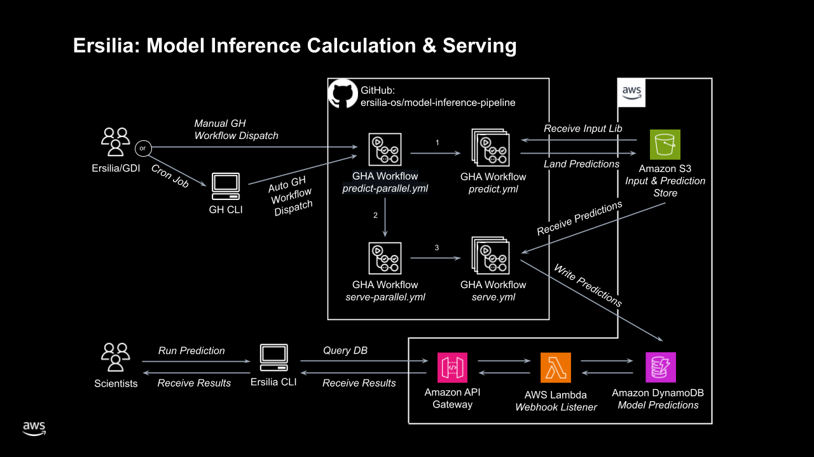

# Ersilia Model Precalculation Pipeline

 

This repository contains code and github workflows for precalculating and storing Ersilia model predictions in AWS.

See [CONTRIBUTING.md](CONTRIBUTING.md) to get started working on this repo.

## Using the Batch Inference Pipeline

### Triggering a pipeline run

The workflow "Run Inference in Parallel" can be triggered from the GitHub UI or via the [GitHub Actions extension](https://marketplace.visualstudio.com/items?itemName=GitHub.vscode-github-actions) (you may have to enter the name of the branch you want to run the pipeline on if you're using the extension). `Actions` > `Run Inference in Parallel` > `Run workflow`. Then, simply enter the ID of the Ersilia Model Hub model that you want to run.

After entering the ID, you can enter a value for 'sample-only' (1, 10, 50, or 100) to run the pipeline on that many inputs (e.g. for testing purposes), or you can leave it to run the pipeline on the whole reference library (which can take several hours). Once the run begins, logs will appear [here](https://github.com/ersilia-os/model-inference-pipeline/actions).

#### Testing
If you just want to test the pipeline, it's recommended that you use 100 for sample-only as this will ensure all 50 workers have inputs to process (to modify this functionality, you can add subsets of the reference library to the precalcs bucket in S3 with the file name being reference_library_{n}.csv, where n is the number of inputs in that file). Any one of them having no inputs means the whole pipeline fails, and parametrising the number of workers based on the number of inputs is possible future work.

Alternatively, you can leave sample-only blank and modify the matrices in predict-parallel.yml and serve-parallel.yml to be `[1,2]`, then use test_input.csv to run the pipeline.

## Architecture and Cloud Infrastructure

Key components:
- inference and serving compute; GitHub Actions workers
- prediction bulk storage; S3 Bucket
- prediction database; DynamoDB
- serverless API; Lambda + API Gateway

All AWS components are managed via IaC with [AWS CDK](https://aws.amazon.com/cdk/). See [infra/precalculator](infra/precalculator/README.md) for details on how to validate and deploy infrastructure for this project.

## Github Actions Workflows

### Prediction

During this workflow, we call the Ersilia model hub for a given model ID and generate predictions on the reference library. The predictions are saved as CSV files in S3.

This works by pulling the [Ersilia Model Hub](https://github.com/ersilia-os/ersilia) onto a GitHub Ubuntu worker and running inference for a slice of the reference library. Predictions are saved to S3 via the AWS CLI.

### Serving

This workflow reads the generated predictions from S3, validates and formats the data, then finally writes it in batches to DynamoDB.

This uses the python package `precalculator` developed in this repo. The package includes:

- validation of input data with `pydantic` and `pandera`
- testing with `pytest`
- batch writing to DynamoDB with `boto3`

### Full Precalculation Pipeline

The full pipeline calls the predict and serve actions in sequence. Both jobs are parallelised across up to 50 workers as they are both compute-intensive processes.

`predict-parallel.yml` implements this FULL pipeline ("Run Inference in Parallel") in a manner which avoids the 6-hour time out limit individual workflows.

---

##### A collaboration between [GDI](https://github.com/good-data-institute) and [Ersilia](https://github.com/ersilia-os)

